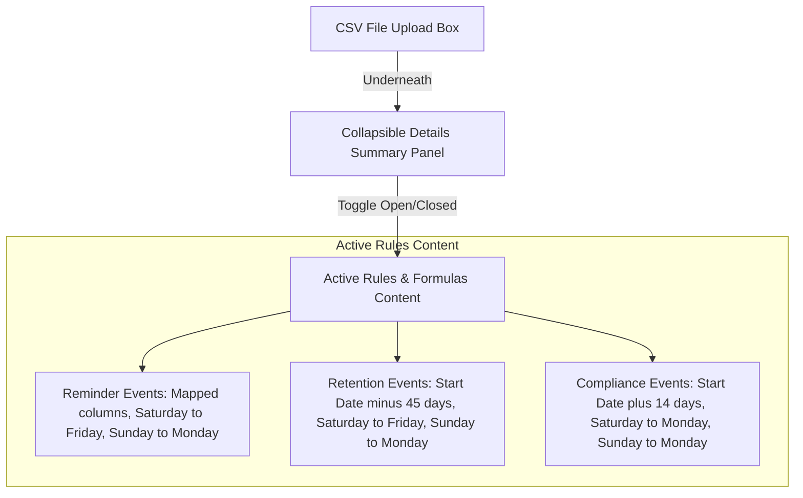

## Context

Administrators using the CSV import interface need a clear, non-intrusive way to understand how the system schedules follow-up check-in events, retention texts, and compliance tracking events. To solve this, we are adding a collapsible, styled accordion panel directly below the CSV file upload area. This panel will act as a static reference card, explaining the mapping columns, date offset formulas, and weekend-shifting directions for each event type without introducing timezone or clock time clutter.

## System Architecture Diagram

## Goals / Non-Goals

**Goals:**
- Implement a modern, collapsible reference accordion panel using native HTML elements.
- Position the panel directly under the CSV file dropzone.
- Clearly present the active event types, source columns, calculation formulas, and weekend-shifting rules.
- Omit timezone and event clock-time details.
- Use clean CSS styles consistent with the project's design tokens.

**Non-Goals:**
- Change backend date parser or event generation logic.
- Modify the existing CSV preview report, counts, or sample card displays.
- Integrate custom state-management JavaScript for the toggle behavior.

## Decisions

- **Decision: Use HTML `
` and `
` Elements**:
  - *Rationale*: Using native HTML collapsible elements ensures optimal accessibility, fast performance, and zero dependency on JavaScript state management.
  - *Alternatives*: Custom jQuery/JS collapsible animations. Reverted because custom JS adds unnecessary complexity and code volume compared to native HTML elements.
- **Decision: Static Frontend Reference Content**:
  - *Rationale*: The date calculations and offsets are core business rules that rarely change. Hardcoding them in the HTML is extremely fast, performant, and avoids unnecessary backend API calls.
  - *Alternatives*: Dynamic rule schema API. Rejected because building an API to serve static configuration rules adds unnecessary development overhead and latency.

## Risks / Trade-offs

- **Risk**: Out-of-sync documentation. If scheduling offsets or weekend-shifting logic are updated in `src/csvParser.js` or `src/calendar.js`, the frontend reference panel will become outdated.
  - *Mitigation*: Place clear developer comments in both the parser files and `public/index.html` reminding future maintainers to update both locations in tandem.
