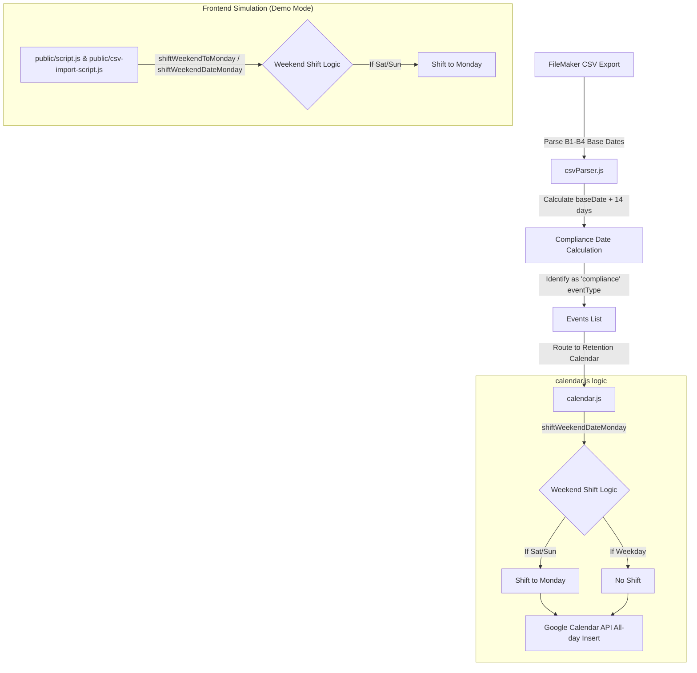

## Context

The lab requested a new all-day "Week 2 Compliance Tracking" event on the API BURST calendar (mapped to Retention Calendar) to track compliance at the end of each 14-day burst. The event must fall on Day 15 of the burst (14 days after the burst start date) and use a custom weekend-shifting rule (Saturday or Sunday moves to Monday). This event must be created for all four bursts (BURST 1, 2, 3, and 4).

## System Architecture Diagram

## Goals / Non-Goals

**Goals:**
- Add compliance event calculations to the CSV parser for all four bursts (BURST 1, 2, 3, and 4).
- Support weekend shifting specifically to Monday for these events.
- Schedule compliance events as all-day events on the Retention Calendar.
- Create a dedicated and isolated weekend shifting function for compliance events to prevent regressions on standard events.
- Update frontend demo mode simulations to correctly mirror weekend shifting rules for compliance events.

**Non-Goals:**
- Change the weekend-shifting behavior of other events (checklists and prior reminders still shift Saturday to Friday and Sunday to Monday).
- Add new manual entry form inputs or routes.

## Decisions

- **Define dedicated helper `shiftWeekendDateMonday(dateStr)`**: We will define a separate helper function specifically for compliance events. When the date is Saturday or Sunday, it is shifted to Monday. This keeps the standard shifting rules for checklists and reminders completely untouched.
- **Collect B1STARTDATE in parser's first pass**: In the existing `csvParser.js` code, only `B2STARTDATE`, `B3STARTDATE`, and `B4STARTDATE` were collected in the first pass (since only Bursts 2, 3, and 4 had retention text events). To schedule compliance events for all four bursts, we will add `B1STARTDATE` to the first pass collection.
- **Add compliance calculation directly to the third pass of the parser**: We will calculate and append compliance events for all 4 bursts, while retaining the logic to only calculate retention events for Bursts 2, 3, and 4.
- **Update Client-Side Demo Simulation**: When the application runs in Demo Mode (`DEMO_MODE=true`), the browser environment intercepts the CSV imports and performs client-side event generation and date shifting. We will duplicate the Saturday/Sunday to Monday weekend shifting logic for compliance events in the frontend javascript scripts (`public/script.js` and `public/csv-import-script.js`) to ensure simulated reports display accurate compliance dates.

## Risks / Trade-offs

- **Risk**: Maintaining two separate shifting functions could lead to duplicated date parsing helper code.
  - *Mitigation*: The date parsing logic (splitting date strings, initializing Date objects) is minimal, and the isolation of the shifting rules completely eliminates the risk of regression in existing code.
