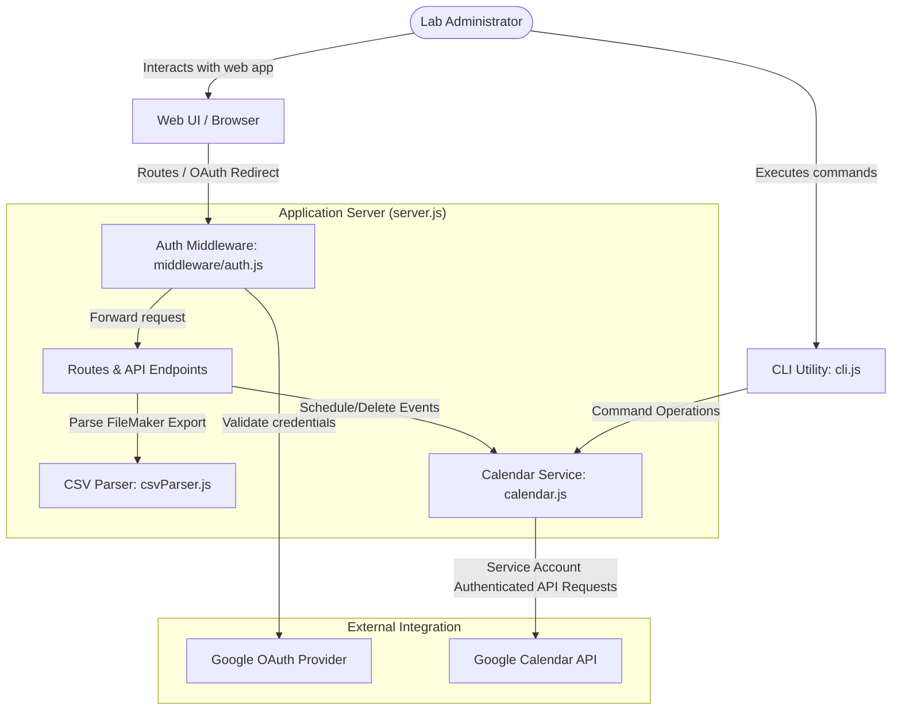

## Context

The Google Calendar Lab Automation project is a Node.js-based application that automates the creation of follow-up check-in events for lab participants. The system operates in two main modes: a manual Web UI (where admins input base dates and participant emails) and a CSV Import pipeline (where CSV exports from FileMaker are processed to schedule events). Calendar operations utilize service accounts to act on behalf of the project, allowing centralized, headless calendar modifications.

## System Architecture Diagram

## Goals / Non-Goals

**Goals:**
- Provide complete structural architectural documentation for the application.
- Delineate web server routes, Google OAuth integration, CSV data schemas, calendar API interaction patterns, and developer command-line interfaces.
- Clear separation between Live Mode (which modifies calendar events) and Demo Mode (which performs dry runs and allows mock actions).

**Non-Goals:**
- Modifying the existing application logic or changing API signatures.
- Adding database support (the app uses in-memory sessions and Google Calendar properties as the database/idempotency state).

## Decisions

- **Service Account-based Authentication for Calendar Operations**: Uses a service account JSON credential for all calendar read/write activities. This avoids demanding Google authorization consents from every administrative user.
- **Idempotency via Event Private Extended Properties**: Events are flagged with a calculated `eventKey` stored in `extendedProperties.private.eventKey` or `idempotencyKey`. The application searches for these keys before executing inserts, ensuring events are not duplicated during re-runs.
- **Weekend Shifting Logic**: The automation automatically shifts events that fall on Saturdays to the preceding Friday, and Sundays to the succeeding Monday to guarantee check-ins happen on weekdays.

## Risks / Trade-offs

- **Risk**: Google API Rate Limits / Service Account Quota.
  - *Mitigation*: The app uses batch limits and runs idempotency searches to check for existing events before attempting event inserts.
- **Risk**: Dependency on Calendar Sharing.
  - *Mitigation*: Service account email must be added with edit permissions to all target calendars. Express route validation checks calendar availability prior to running import previews.
